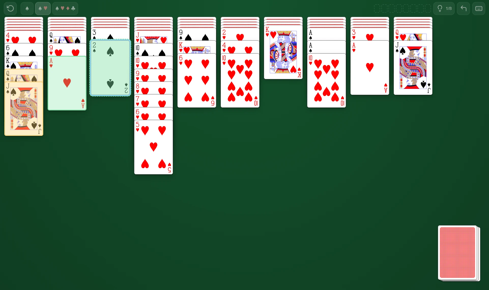

# Spider

Spider solitaire in a single HTML file. No build step, no dependencies, no network.

**[Play it here](https://ellgree.github.io/spider-cards/)** — or download the file
and open it, which works just as well.

## Play

Download `index.html` and double-click it. That is the whole installation
procedure — the file carries its own card artwork, so it works from a USB stick,
an e-mail attachment or a `file://` URL with nothing beside it.

(The file is named `index.html` rather than `spider.html` so that GitHub Pages
serves it at the address above. Rename it to anything you like once it is on your
disk; nothing inside depends on the name.)

## Rules

Two full decks, 104 cards, dealt into ten columns.

- **Take** a descending run of a *single* suit — `♠9 ♠8 ♠7` moves as one, `♠9 ♥8 ♠7`
  does not.
- **Put** it on any card one rank higher, *suit ignored*, or into an empty column.
- **Deal** a row of ten from the stock — but only while every column has a card in
  it. This rule is the one people forget, and skipping it makes deals unwinnable.
- A complete `K → A` run of one suit leaves the table. Clear all eight and you win.

The suit picker chooses the difficulty: one suit is a gentle puzzle, four suits is
the real game.

## Controls

Mouse and keyboard share one selection, so you can switch between them mid-move.

| Key | Does |
| --- | --- |
| `←` `→` | move across the columns, and onto the stock past the last one |
| `↑` `↓` | move up and down inside a column |
| `Enter` | pick up the run under the cursor, or put down what you are holding; on the stock, deal |
| `Esc` | drop what you are holding |
| `Space` | deal a row from the stock |
| `H` | hint — press again to walk through the ranked alternatives |
| `Ctrl`+`Z` | undo (all the way back to the deal) |
| `F2` | new game |
| `F1` | show this key map |

With a pointer: drag a run where it should go, or click once to pick it up and once
again to drop it. Double-click plays the best available move for that run.

## Reading the table

The interface has no words in it, so here is what the marks mean.

| Mark | Meaning |
| --- | --- |
| amber fill | the run you are holding |
| green fill, solid outline | the hint's suggested move |
| green fill, dashed outline | where it wants to go |
| violet fill | a legal move that gains you nothing |
| blue ring | where the keyboard cursor is |

The hint button is also the state light: a bulb with a counter while moves exist, an
arrow-into-a-stack when the only thing left to do is deal, a crossed circle at a dead
end, a tick when the game is won.

## On phones

Landscape only — ten columns do not fit across a portrait screen, and the game asks
you to turn the device rather than shrink the cards past reading. It tries to go
fullscreen and lock the orientation on first tap; browsers that refuse (iOS Safari
has no orientation lock at all) get the rotate prompt instead. Pull-to-refresh,
double-tap zoom and the long-press menu are all turned off, because every one of
them fires on gestures this game needs.

## How it is built

One file, on purpose. About 580 KB of it is the card artwork, inlined as
percent-encoded `data:` URIs in a generated `<style id="deck">` block — that is the
price of a game you can send to someone as a single attachment, and it seemed worth
paying. The hand-written part is the ~150 lines of CSS above it and ~950 lines of
JavaScript below.

The layout has one hard promise: **the table always fits the window.** No scrolling,
no column running off the bottom edge, whatever the deal and whatever the window
size. A single function, `fit()`, is allowed two dials and pulls them in order —
first it squeezes the cascade steps down to a readable floor, and only then does it
shrink the card itself. Steps go first because a tighter step costs nothing but the
blank middle of a card, while a smaller card costs the artwork.

State lives in one object that the DOM is drawn from and never read back into, which
is what makes undo a snapshot instead of an inverse operation per move type.

## Credits

Card faces and backs are the **SVG playing cards by Adrian Kennard (RevK)**, released
into the public domain under CC0 — <https://www.me.uk/cards>, source at
<https://codeberg.org/RevK/SVG-playing-cards>. The author asks for no credit and
requires none; this note is here because the deck deserves it. The link he embeds in
the ace of spades has been removed from this copy, which CC0 permits.

Everything else — the icons included — is drawn for this project.

## Licence

MIT, see [LICENSE](LICENSE).
